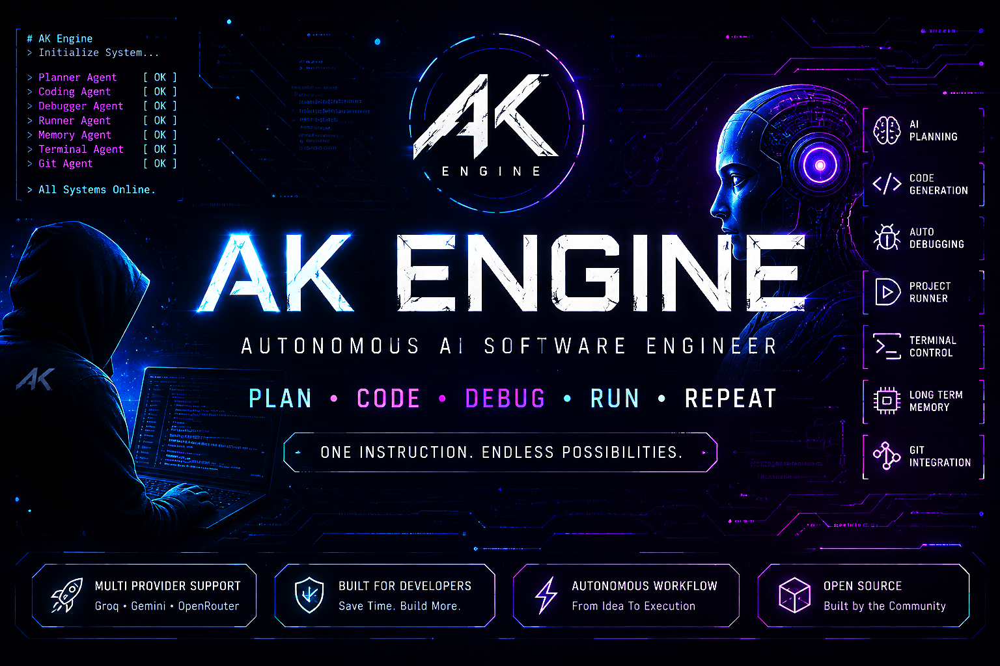

# ⚡ AK Engine

  

> An autonomous AI software engineering framework that can plan, write, debug, run, and manage Python projects using multiple AI providers.

---

# 🚀 Why AK Engine?

Most AI assistants only answer questions.

AK Engine actually performs software engineering tasks.

Instead of asking:

> "How do I build this?"

You simply say:

> "Build this."

AK Engine automatically plans, writes, debugs, runs, and manages projects.

---

# ✨ Features

- 🧠 AI Project Planner
- 💻 Python Code Generator
- 🐞 Automatic Debugger
- ▶️ Project Runner
- 📁 File Manager
- 🖥️ Terminal Agent
- 🧭 AI Task Router
- 💾 Memory System
- 🌐 Multi Provider Support
- 🔀 Git Integration

---

# 🤖 Supported AI Providers

- Groq
- Google Gemini
- OpenRouter

The engine automatically switches providers when one fails or reaches its limit.

---

# 🏗 Architecture

User
↓
Manager Agent
├── Planner Agent
├── AI Router
├── Coding Agent
├── Debugger Agent
├── Runner Agent
├── File Agent
├── Terminal Agent
├── Git Agent
└── Memory Agent

---

# ⚙ Installation

git clone https://github.com/asikur786rahman00-ai/AK-Engine.git

cd AK-Engine

python -m venv venv

source venv/bin/activate

pip install -r requirements.txt

---

# 🚀 Quick Example

User:

Create a Python calculator

↓

Planner creates project plan

↓

Coding Agent writes code

↓

Runner executes project

↓

Debugger fixes errors

↓

Working application

---

# 📂 Current Agents

✅ Manager Agent

✅ Planner Agent

✅ Coding Agent

✅ Debugger Agent

✅ Runner Agent

✅ Terminal Agent

✅ File Agent

✅ Git Agent

✅ Memory Agent

✅ AI Router

---

# 🛣 Roadmap

- ✅ Multi AI Providers
- ✅ Automatic Planning
- ✅ Automatic Coding
- ✅ Automatic Debugging
- ✅ Automatic Project Running
- ✅ Git Integration
- ✅ Memory System
- ⬜ Web Search Agent
- ⬜ Docker Agent
- ⬜ Browser Agent
- ⬜ Voice Assistant
- ⬜ Multi-file Project Builder
- ⬜ Autonomous Software Engineer

---

# 🎯 Vision

AK Engine aims to become a fully autonomous software engineer capable of planning, generating, testing, debugging, documenting, and managing complete software projects from a single instruction.

---

# 🤝 Contributing

Contributions are welcome.

Feel free to open issues, submit pull requests, or suggest new features.

---

# 📜 License

MIT License

---

# 👨‍💻 Author

**Asikur Rahman (AK)**

GitHub:
https://github.com/asikur786rahman00-ai

Building autonomous AI systems from a mobile phone using Termux.
